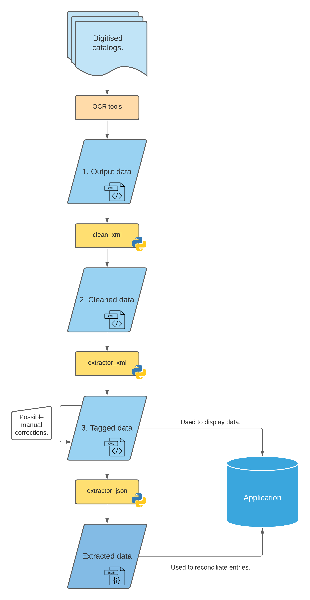

# Application

This repository contains the web publication application of the corpus of manuscript sales catalogues.

## Getting started :

* First, download this repository. Using command lines, clone the repository with :
```bash
git clone https://github.com/katabase/Application.git
cd Application
```
* Then, create a virtual environment and activate it :
```bash
python3 -m venv my_env
source my_env/bin/activate
```
* Now, you have to install dependencies :
```bash
pip install -r requirements.txt
```
* You can finally launch the application :
```bash
python3 run.py
```

## Workflow



## Credits

The application was designed by Alexandre Bartz with the help of Simon Gabay, Matthias Gille Levenson and Ljudmila Petkovic.

## Cite this repository

## Licence
<a rel="license" href="http://creativecommons.org/licenses/by/4.0/"></a><br />This work is licensed under a <a rel="license" href="http://creativecommons.org/licenses/by/4.0/">Creative Commons Attribution 4.0 International Licence</a>.

__Please note that this repository is still under construction.__